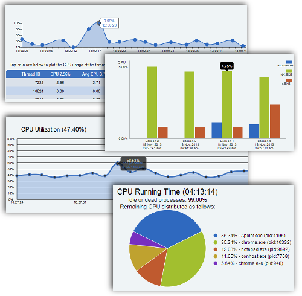
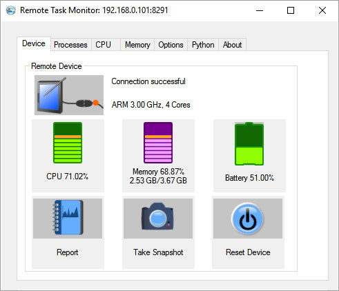

# Remote Task Monitor

A Task Manager for Windows Embedded Devices

Have you been struggling to monitor your apps on Windows embedded devices? Do you wish there was an easy way to check their CPU and memory usage?

  
Now there is!

  

Now there is!

### Get Real Time CPU Load, Memory Usage, Alerts & Reports About Your Device

-   Lets you see the CPU usage of each process and thread on the device in real time
-   See memory usage of processes
-   Plot graphs in real time for the memory and CPU usage of processes and threads
-   Generate reports for offline viewing
-   Send you email alerts when CPU is high, memory is low, or if a process on target device crashes
-   Gives you the call stack of
 a crashing process to help you locate the offending code

### Automatically Discovers and Connects to Device

1.  Run the CEmon server on your device
2.  Run RTM client on your PC
3.  RTM client will automatically discover the device and connect to it
4.  RTM will start collecting CPU and memory usage data from the remote device and display it to you on your PC.

### Supported Platforms

ARM and x86 platforms

### Source Code Available

The download package also includes the source code you can use to build for your specific device. (You will need Visual Studio and your Platform SDK to compile)

### Supported OS's

WinCE 5, WinCE 6, Windows Embedded Compact 7 (WEC 7)

### CPU and Memory Utilization

### Processes & Threads

  

Select one or more processes or threads, and right click, to see a list of operations you can perform.

  

### Operations

-   Kill a process
-   Start a new process
-   Clone a process
-   Restart a process
-   Kill a thread
-   Suspend thread
-   Resume thread
-   Change thread priority at runtime
-   View real time plots of CPU usage per process and thread
-   Record CPU usage in the HTML report
-   Alert you by email when a process on watch crashes
-   Give you call stack of the process when it crashes (The call stack lets you identify the functions that were called just before the process crashed)
-   Alert you when a process or thread exceeds a set CPU threshold
-   Alert you when memory falls below a set threshold

### Thread Names

You can also display names for the threads by specifying the names in threads.txt file following in format:

  

<thread id>:<thread name>

<thread id>:<thread name>

<thread id>:<thread name>

  

(Remove the < and >)

  

Each line must be terminated by new line carriage return characters and the thread name must be less than 30 characters. The  _threads.txt_  file should be copied to the file system in the device.

### Real Time Plots

The graph shows the overall CPU and memory usage as a function of time. You can also add and remove individual processes and threads.

  

### Reports

A report is generated in HTML at the end of each session.

  

This lets you collect statistics about your device by monitoring it for several days or weeks at a time, allowing you to make a decision how well your app behaves over a long run.

  

In the Processes tab, right click on the process or thread to add it to the report.

  

  

You can select from the drop down list individual processes or threads and view their CPU usage.

  

The  _log.csv_  file conatins all the CPU usage statistics for the session.

  

### Crash Watch

Make your app stable by monitoring it for a crash, and quickly determining the cause of crash.

  

The crash watch tool in RTM monitors your app for any kind of violation that would cause it to crash. You can set it to email you the crash report when that happens. It will identify the type of violation, the address of code where the process crashed, and the call stack. If you provide a map file from VS2005 for your app, then you could even see the function names in the call stack.

  

  

### CPU Watch

You can put a process or thread on CPU watch, when process takes CPU more than the set value, you can get an alert and an email notification.

  

  

There is also an overall CPU watch, when the total CPU exceeds the set value, you can get the alert and email notification.

  

### Memory Watch

You can also put a process on memory watch, when process consumes more memory than the set value, you can get an alert and an email notification.

  

### Remote Task Monitor Automation using Python

 
Remote Task Monitor can be programmed through Python scripts. That means you can write scripts for most of the things you would do through the Remote Task Monitor.

  

  

Here is an example script that opens a connections to target device, starts capturing snapshots, and prints the CPU and memory usage, then emails the location of the report.  

  

> import  rtm  
> def  main():  
> if(0==rtm.connect("162.96.0.9",  8291)):  
> print("Check IP and port, and check that you are not already connected.")  
> else:  
> loop =  True  
> count =  0  
> connected =  False  
>   
> # Get 20 snapshots of the target device  
> while  (loop  and  count <  20):  
> r = rtm.wait(-1)  
> #print(r)  
> if  (r['reason'] ==  'quit'  or  r['reason'] ==  'disconnected'):  
> loop =  False  
> connected =  False  
> print("Could not connect to target. Check your IP/Port, cemon is running on target device and a TCP/IP connection is available.")  
> elif  (r['reason'] ==  'connected'):  
> rtm.startcapture()  
> rtm.enablepsmemstats(1)  
> count =  0  
> connected =  True  
> print("Connected")  
> elif  (r['reason'] ==  'gotsnapshot'):  
> process_snapshot()  
> count=count+1  
>   
> # Disconnect and get the report for the session  
> report =  ''  
> if(connected):  
> rtm.disconnect()  
> print("Disconnecting")  
> r = rtm.wait(-1)  # Wait to be disconnected  
> if(r['reason'] ==  'disconnected'):  
> report = r['report']  
> print(report)  
> # Send an email with path to the report file  
> rtm.email("foo@bar.com",  "RTM Report",  "Report is here: "  + report)  
>   
> return  0;  
> def  process_snapshot():  
> msg =  'Total CPU '+ str(rtm.gettotalcpu()) +  '%, Total memory '  + str(rtm.getavailmem()) +  ' Bytes'  
> print(msg)  
>   
> #Get list of all processes  
> pss = rtm.getpss()  
> #print(pss)  
> if(pss):  
> for  ps  in  pss:  # Iterate though each process in the list  
> #print(ps)  
> if(ps['name'] ==  'cemon.arm5.exe'):  
> print('cemon.arm5.exe CPU usage: '  + str(ps['cpu']) +  '%')  
> #Get list of all threads in this process  
> ths = rtm.getthreads(ps['pid'])  
> if(ths):  
> for  th  in  ths:  # Iterate though each thread in the list  
> #print(th)  
> if(th):  
> print('Running at priority '  + str(th['priority']))  
> return  0;

  Write your script in Python 3.2, and load the .py file in the Python tab of Remote Task Monitor. Then hit the Run button.

### Who has Used Remote Task Monitor

